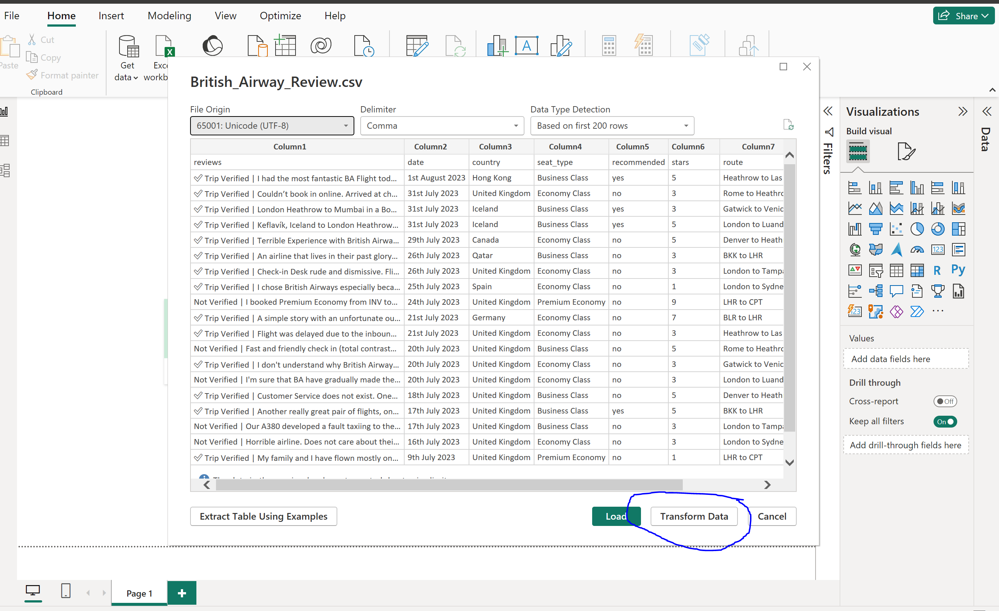
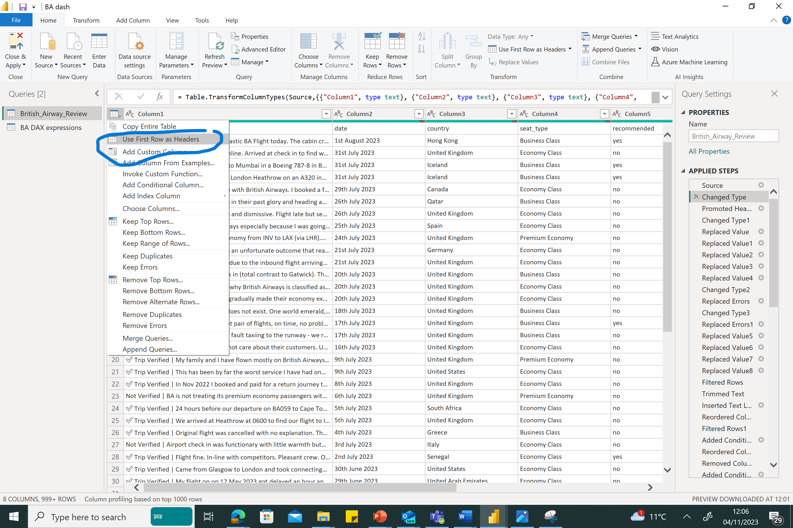
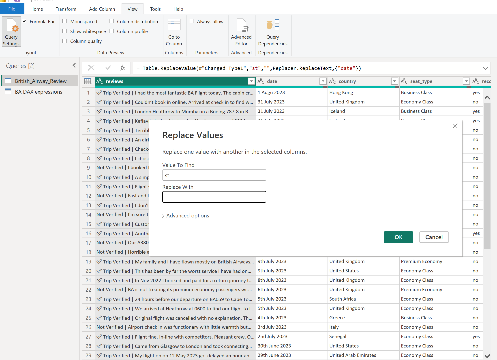
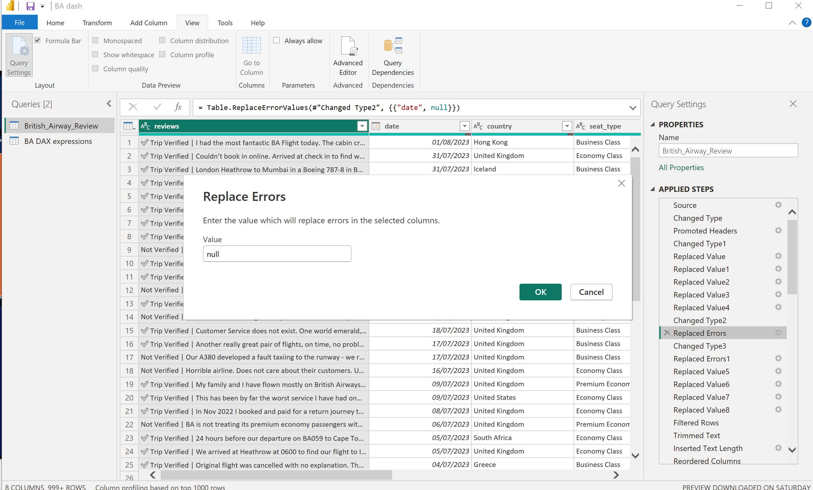

# British-Airways-Analysi

## Introduction 
British Airways, a globally renowned airline, has a long history of excellence and reliability, making it a preferred choice for travelers worldwide. The airline's commitment to exceptional customer experiences is a key element of its success. In this document, we will explore how data analysis can help British Airways improve customer satisfaction and retention rates.

**_Disclaimer_** : _All datasets and reports do not represent any company, institution or country, but just a dummy dataset to demonstrate the capabilities of PowerBI
## Objectives

British Airways aims to enhance customer satisfaction and retention. The airline seeks to identify the most critical factors influencing customer satisfaction and implement improvements to deliver a better customer experience.

## Questions Answered 

1. How many valid customer feedbacks are considered in this analysis?
2. What is the average star rating for British Airways?
3. Which country of origin do these customers originate from?
4. What is the highest flight route?
5. Are the clients more willing to recommend British Airways?
6. Do seat types influence British Airways recommendation ratio?
7. What are the most common type of travelers?
8. Choose a chart that can effectively show the years, number of customers, by breakdown of recommendation ratio.

## Skills Demonstrated

This documentation demonstrates key data analysis skills, including 
- ETL
- DAX
- Quick measure
- Page Navigation
- Filtering with slicer
- Tooltip
- Button
- visualization.

## Data Extraction

The **import mode** was used to extract our dataset which was in a csv format, we selected the **text/csv** option under the **get data** menu in the home tab. The CSV file was then located and chosen.

## Data Transformation
To ensure data quality and also making sure our analysis addresses the business issues, we need to transform the data and perform wrangling and cleaning, irrelivant records or columns can also be removed to optimise the performance of the dashboard during a schedule refresh.

The following transformations were applied
1.	the data set was renamed 
2.	Promote the headers

3.	To neable us carry out trend analysis, we also needed to change the date format but before changing the datatype, we need to adjust each entry by removing the surfix after each days i.e 1st becomes 1.
This was done on the **transform tab**, thesame step was replicated with **nd**,**rd** and **th**. Although, there was a problem with the month **August** that was affected due to the **st** in front, therefore, I replaced **Augu** with **August** yet again.

5.	We then  changed the data type to date and replaced error with null

7.	There were also inconsistencies in the entries under the “route” column such as some airports being abbreviated and others were not, so to maintain consistency, the abbreviated values were replaced with their actual airport names, as you can see from the picture, LHR was replaced with Heathrow.
8.	We also realised that the column “country” had some incorrect entries due to customers input of unrelated answer to the column, I realised that the length of those wrong entries were higher than most countries name in the column, so I had to extract the length of the “trimmed” values from the “add column” tab and subsequently did a conditional column called “new_country” with the condition that any length greater than 25 should be empty while the values under the column “Country” whose length is lesser or equal should be left untouched.
9.	We also observed that the seat_type had invalid entries as well, so we adopted the conditional column to make the invalid entries blank as seen in the screen shot.
10.	The same applies to the “recommend” column which is asking customers if they will recommend BA (From the data dictionary). A conditional column was used again to make invalid columns blank.
11.	The satisfaction level was created from the star column which ranged from 1-9, this was then categorised from very dissatisfied to very satisfied.
12.	The route was also amended to remove invalid entries.

