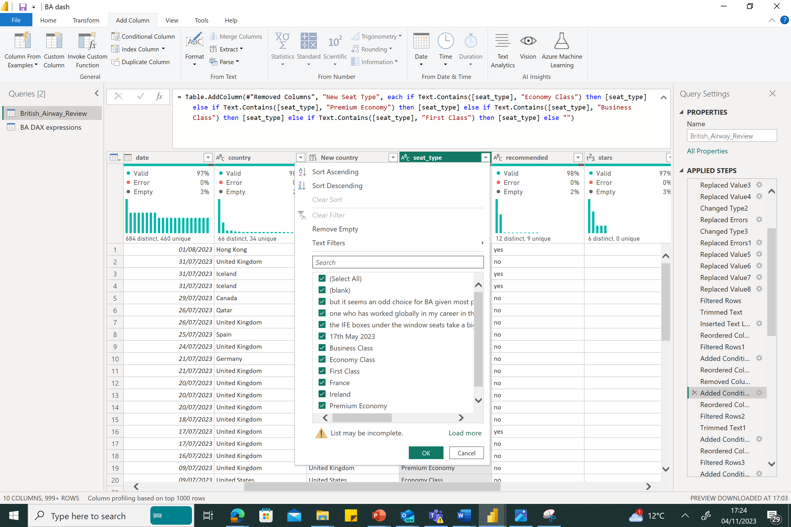

# British-Airways-Analysis

## Introduction 
British Airways, a globally renowned airline, has a long history of excellence and reliability, making it a preferred choice for travelers worldwide. The airline's commitment to exceptional customer experiences is a key element of its success. In this document, we will explore how data analysis can help British Airways improve customer satisfaction and retention rates.

**_Disclaimer_** : _All datasets and reports do not represent any company, institution or country, but just a dummy dataset to demonstrate the capabilities of PowerBI_

## Objectives

British Airways aims to enhance customer satisfaction and retention. The airline seeks to identify the most critical factors influencing customer satisfaction and implement improvements to deliver a better customer experience.

## Questions Answered 

1. How many valid customer feedbacks are considered in this analysis?
2. What is the average star rating for British Airways?
3. Which country of origin do these customers originate from?
4. What is the highest flight route?
5. Are the clients more willing to recommend British Airways?
6. Do seat types influence British Airways recommendation ratio?
7. What are the most common type of travelers?
8. Choose a chart that can effectively show the years, number of customers, by breakdown of recommendation ratio.

## Skills Demonstrated

This documentation demonstrates key data analysis skills, including 
- ETL
- DAX
- Quick measure
- Page Navigation
- Filtering with slicer
- Tooltip
- Button
- visualization.

## Data Extraction

The **import mode** was used to extract our dataset which was in a csv format, we selected the **text/csv** option under the **get data** menu in the home tab. The CSV file was then located and chosen.

## Data Transformation
To ensure data quality and also making sure our analysis addresses the business issues, we need to transform the data and perform **data wrangling** , irrelivant records or columns can also be removed to optimise the performance of the dashboard during a schedule refresh.

The following transformations were applied
1.	the data set was renamed 
2.	Promote the headers

3.	To enable us carry out trend analysis, we also needed to change the date format but before changing the datatype, we needed to adjust each entry by removing the suffixes after each days i.e 1st becomes 1.
This was done on the **transform tab**, the same step was replicated with **nd**,**rd** and **th**. Although, there was a problem with the entry **August**, it was affected due to the **st** in front of it, therefore, I replaced **Augu** with **August** yet again.

4.	I then changed the data type to date and replaced error with null. All these happened on the **Transform** Tab and clicking on **replace values/ errors**

5.	There were also inconsistencies in the entries under the **route** column such as some **airports** being abbreviated and others were not, so to maintain **consistency**, the abbreviated values were replaced with their actual airport names, as you can see from the picture, **LHR**was replaced with **Heathrow** and others.

6.	We also realised that the column **country** had some incorrect entries due to customers input of unrelated answer to the column, I realised that the **length of those wrong entries** were higher than most **countries name** in the column, so I had to get the **length** of the **trimmed values** from the **add column tab** and subsequently added a **conditional column** called **new_country** on the condition that any length greater than 25 should be empty while the values whose length are lesser or equal should be left untouched. Some **date value** were also removed.

7.	We also observed that the **seat_type** had invalid entries as well, so we adopted the conditional column to make the invalid entries blank as seen in the screen shot.

column showing invalid entries      |    conditional column
:----------------------------------:|:----------------------------:
          |               

8.	The same applies to the **recommend** column which is asking customers if they will recommend BA **(From the data dictionary)**. A conditional column was used again to make invalid columns blank.
   
9.	The **satisfaction level** was created from the **stars** column which ranged from 1-9, this was then categorised from **very dissatisfied to very satisfied**.

## Analysis and Visualization

Data Analysis Expressions (DAX) functions were used to perform the following analysis:

**Calculating the total number of valid customer reviews.**

Total Customer Review = COUNTA(British_Airway_Review[reviews])

**Determining the average star rating.**
The DAX expression was written as AVG star rating = AVERAGEA(British_Airway_Review[stars]) then the **guage visual** was used to display the rating, the **guage** was the preferred visual because it helps in displaying the **minimum and maximum values** with the average value which is **4.29**. 

For an appealing and relatable navigation, a black background was selected from the **canvas background** followed by rectangular shapes of proportionate sizes where each visuals will fit in.

## Dashboard

## Discussion
👎 Alarming discovery: 64.53% of customers wouldn't recommend BA due to their experience, and this percentage has been declining over the years. In 2015, over 50% said they would recommend, but it has since dropped below 50% and got to a staggering . The Donut chart was used to display this with data labels that shows executives the percentages.
the two **bookmarks** show decline of reccomendation from 2015 to 2023.

**🌍 Purpose of travel**: Passengers mostly travel for couple leisure, with other purposes being business, family leisure, and solo travel. A clustered column chart was used to visualize this.

**✈️ Seat types**: Most reviews come from passengers in the economy class (1310), followed by business class (720). Other seat types include premium economy and first class. Tree map was adopted for this visual. The **reccomended ratio was thesame for all seat types as all four will mostly not reccomend BA**

**✈️ Flight route**: the highest flight route was from Denver to London Heathrow with a total flight of 245 trips, although there was not a significant margin between those routes as seen in the dashboard. 

**🌏 Passenger origin**: the matrix table indicated that majority of the customers are predominantly from the United Kingdom (1486), followed by the United States (292).

**📈 Satisfaction levels**: Ratings from 1 to 9 were used to measure satisfaction. Unfortunately, customers have consistently been dissatisfied over the eight-year period.

A **Drill through filter** was used to navigate down to **customers' comments page** from the satisfation visuals.

**📣 Popular complaints from customers include:**
- Bad shoulder straps
- Weak Wi-Fi connections
- Limited food options
- Sub-par customer service
- Occasional server downtime leading to long queues
- Narrow seats
- Infotainment issues
- Safety instructions only in English, despite diverse passengers
- Bag handling causing significant delays

## 🚀 Recommendations:

**Now, the key question is, "What can British Airways do to improve?"**
1. Customer Engagement Team: Establish a dedicated team focused on engaging with customers, addressing their concerns promptly, and ensuring a seamless experience.

2. Near Real-Time Feedback Mechanism: Introduce a feedback mechanism integrated with infotainment systems, allowing passengers to share their experiences and grievances during their journey.

3. Root Cause Analysis and Segmentation: Dig deeper into customer comments to identify root causes of recurring issues. Segment comments to pinpoint specific pain points across different passenger groups.

4. Continuous Improvement Culture: Foster a culture of continuous improvement within the organization. Encourage employees at all levels to contribute ideas and solutions for enhancing customer satisfaction.

5. Data Analysis Integration: Make data analysis a routine part of operations. Use data proactively to identify emerging issues and address them before they escalate.

